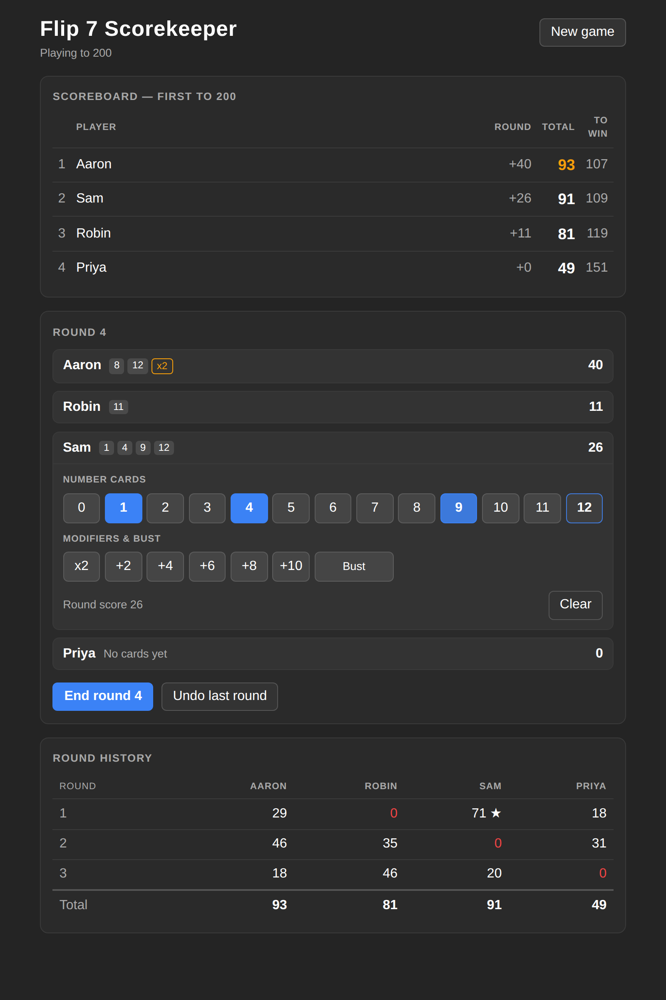

# Flip 7 Scorekeeper

Scorekeeper for the Flip 7 card game. Tap the cards each player collected and it does the
arithmetic: `x2` before the `+` modifiers, 0 for a bust, and the +15 bonus for a Flip 7.

The whole game — including the round you are in the middle of — is written to **IndexedDB** on every
tap, so refreshing, backgrounding the tab, or losing the browser never loses the score.

## Usage

Visit https://aaronj1335.github.io/flip7/

1. Enter player names and the target score (200 by default), then **Start game**.
2. Tap a player to open their card pad. Tap the number cards they collected, any modifier cards
   (`x2`, `+2` … `+10`), or **Bust**. The round score updates as you tap.
3. **End round** commits the round, adds it to the running totals and opens the next one.
   **Undo last round** reopens the previous round if something was mis-recorded.
4. When someone crosses the target score the game closes and the leader is declared the winner.

Finished and abandoned games stay in the browser's database and can be resumed or deleted from the
**Saved games** list on the new-game screen.

### Scoring

| Card | Effect |
| --- | --- |
| `0`–`12` | Added to the round score |
| `x2` | Doubles the number cards (applied before the `+` cards) |
| `+2`, `+4`, `+6`, `+8`, `+10` | Added after `x2` |
| Flip 7 | Seven number cards in a hand scores an extra +15 |
| Bust | The hand scores 0, whatever else it holds |

## Developing

Do whatever is in `.github/workflows/ci.yml`, but roughly:

1. `npm install`
2. `npm run dev`
3. Open `http://localhost:3000` in a web browser

To validate changes:

1. `npm run lint`
2. `npm run typecheck`
3. `npm test`
4. `mkdir -p pages-public && npm run build > pages-public/index.html`

`npm run build` writes a single self-contained `index.html` (JS and CSS inlined) to stdout, which is
what gets published to GitHub Pages. Snapshot tests can be refreshed with
`npm run test:update-snapshots`.

## Layout

| Path | What it is |
| --- | --- |
| `src/game.ts` | Scoring rules and state transitions, as pure functions |
| `src/db.ts` | IndexedDB persistence behind the `GameStore` interface |
| `src/useGame.ts` | React hook that loads, mutates and saves the active game |
| `src/components/` | Presentational components, each with a snapshot test |
| `scripts/dev.ts` | esbuild dev server with live reload |
| `scripts/build.ts` | Single-file static build for GitHub Pages |

The build tooling and project layout follow
[aaronj1335/plottimeseries](https://github.com/aaronj1335/plottimeseries): esbuild driven by plain
node scripts, `node:test` for tests, typescript-eslint for linting, and a GitHub Actions workflow
that lints, typechecks, tests and deploys to Pages on every push to `main`.
